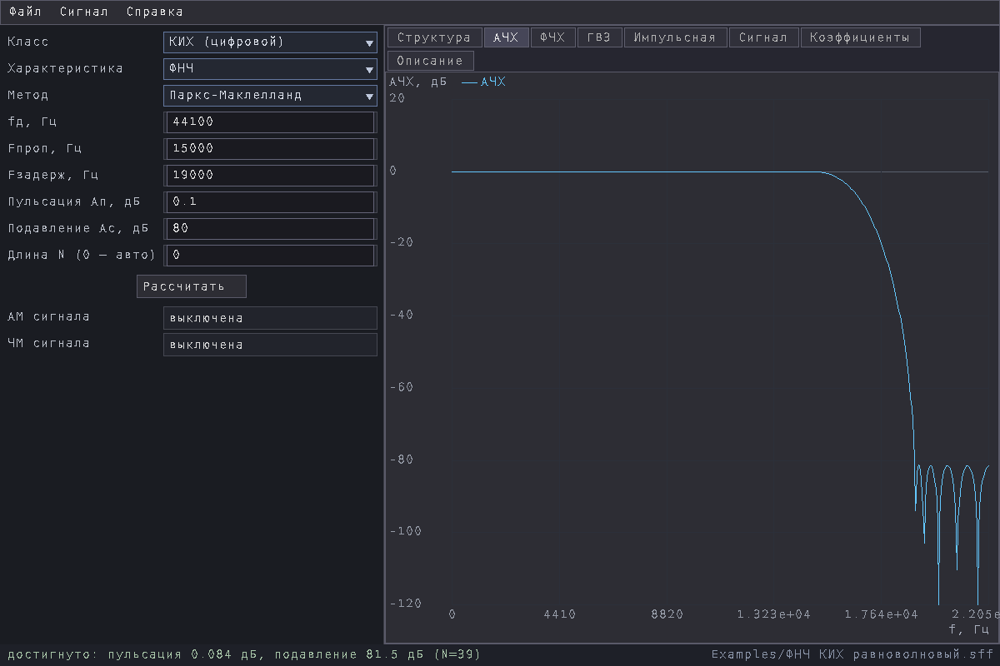
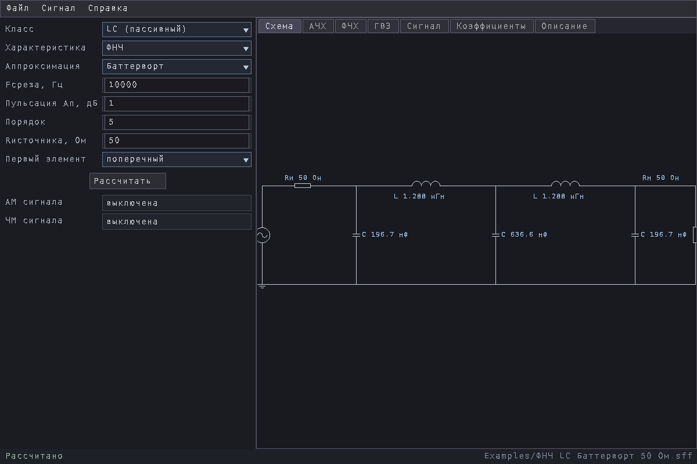
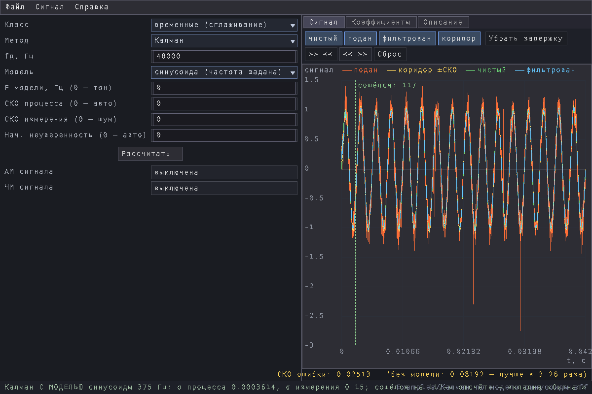

# SigFilterForge

**Filter design, from a requirement to parts you can solder.** You say what you
want — passband and stopband edges, ripple, attenuation — and get a finished
filter: coefficients or component values, the response as plots, a drawn
schematic, and a description in words of what came out.



Five classes of filter are computed:

| Class | What you get | Method |
|---|---|---|
| **FIR** (digital) | the coefficients `h[n]` | Parks-McClellan (Remez exchange), equiripple; also moving average |
| **IIR** (digital) | biquad sections | analogue prototype → bilinear transform; also exponential smoothing |
| **LC** (passive) | inductor and capacitor values | insertion loss method: a ladder or coupled resonators |
| **Op-amp** (active RC) | resistor and capacitor values per stage | prototype poles → Sallen-Key / MFB (Rauch) stages |
| **time-domain** | an estimate over time, no frequency response | median, alpha-beta-gamma, Kalman, ALE |

Shapes: low-pass, high-pass, band-pass, band-stop, and a FIR Hilbert
transformer. Approximations: Butterworth, Chebyshev I, Chebyshev II, elliptic
(Cauer).

**Note on language:** the program's interface is **in Russian**, and so is the
manual — [Руководство.md](Руководство.md). This page is the only English text
here. The screenshots below show what the windows actually look like.

## Running it

```sh
./sigfilterforge                 the window
./sigfilterforge project.sff     the window with a project loaded
./sigfilterforge --selftest      internal checks, no window
```

Linux x86-64 and SDL2. The `assets` directory must sit beside the binary — the
font is taken from it; the program needs nothing else. `SFF_CONFIG_DIR`
overrides where window size and font scale are kept.

## Ready-made projects

`Examples/` holds 7 projects, one per class — open one and change it, that is
the quickest way in. A project file keeps the **specification**, not the result:
loading it recomputes everything, so the file cannot drift out of step with
itself.

| | |
|---|---|
|  |  |
| a passive LC ladder with part values | the signal laboratory: clean, fed and filtered |

1,2M in total. The binary is stripped, 884K; its own checks: Приёмка: 329 проверок, отказов 0, пропущено 1 (нужен каталог разработки).

## License

MIT — see [LICENSE](LICENSE). The MIT text covers "the Software **and
associated documentation files**", so the manual, the screenshots and the
example projects are under the same terms: use, copy, modify and redistribute
them, including in closed and commercial products, keeping the copyright
notice.

Built on 07.09.2026.
